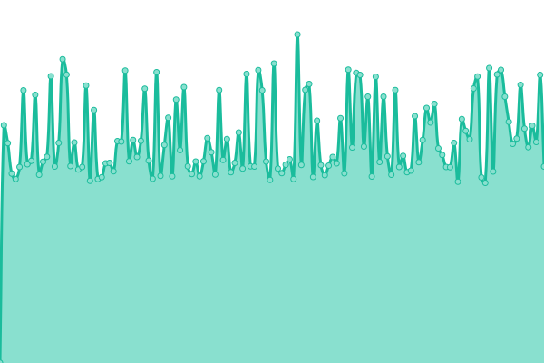
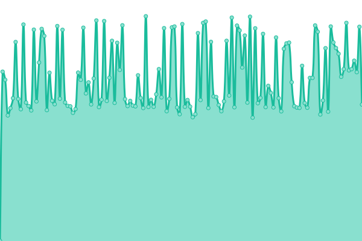
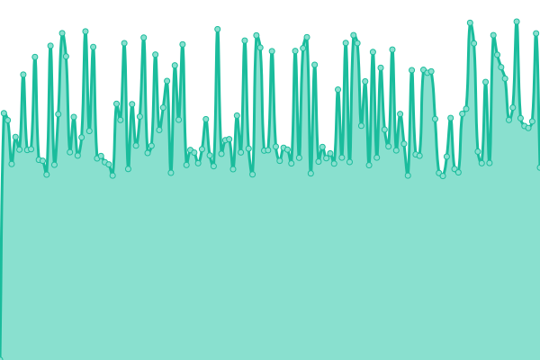
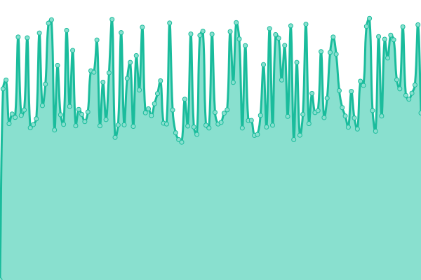
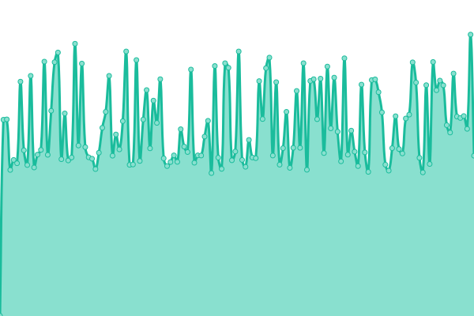
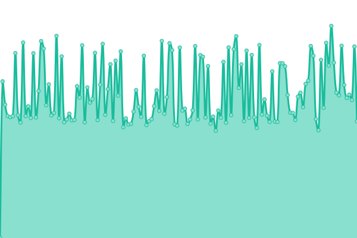

# [📈 Live Status](https://SRESchool.github.io/All-MyHospitalNow-Websites-Uptime-Monitor): <!--live status--> **🟧 Partial outage**

This repository contains the open-source uptime monitor and status page for [SRESchool](https://SRESchool.github.io/All-MyHospitalNow-Websites-Uptime-Monitor), powered by [Upptime](https://github.com/upptime/upptime).

With [Upptime](https://upptime.js.org), you can get your own unlimited and free uptime monitor and status page, powered entirely by a GitHub repository. We use [Issues](https://github.com/SRESchool/All-MyHospitalNow-Websites-Uptime-Monitor/issues) as incident reports, [Actions](https://github.com/SRESchool/All-MyHospitalNow-Websites-Uptime-Monitor/actions) as uptime monitors, and [Pages](https://SRESchool.github.io/All-MyHospitalNow-Websites-Uptime-Monitor) for the status page.

<!--start: status pages-->
<!-- This summary is generated by Upptime (https://github.com/upptime/upptime) -->
<!-- Do not edit this manually, your changes will be overwritten -->
<!-- prettier-ignore -->
| URL | Status | History | Response Time | Uptime |
| --- | ------ | ------- | ------------- | ------ |
|  [Askdoctorlive](https://ASKDOCTORLIVE.COM) | 🟩 Up | [askdoctorlive.yml](https://github.com/SRESchool/All-MyHospitalNow-Websites-Uptime-Monitor/commits/HEAD/history/askdoctorlive.yml) | 

 1044ms
     
 | 

<a href="https://SRESchool.github.io/All-MyHospitalNow-Websites-Uptime-Monitor/history/askdoctorlive">90.67%</a>
    

|  [Bestcardiachospitals](https://BESTCARDIACHOSPITALS.COM) | 🟩 Up | [bestcardiachospitals.yml](https://github.com/SRESchool/All-MyHospitalNow-Websites-Uptime-Monitor/commits/HEAD/history/bestcardiachospitals.yml) | 

 1116ms
     
 | 

<a href="https://SRESchool.github.io/All-MyHospitalNow-Websites-Uptime-Monitor/history/bestcardiachospitals">88.33%</a>
    

|  [Bestcosmetichospitals](https://BESTCOSMETICHOSPITALS.COM) | 🟩 Up | [bestcosmetichospitals.yml](https://github.com/SRESchool/All-MyHospitalNow-Websites-Uptime-Monitor/commits/HEAD/history/bestcosmetichospitals.yml) | 

 1139ms
     
 | 

<a href="https://SRESchool.github.io/All-MyHospitalNow-Websites-Uptime-Monitor/history/bestcosmetichospitals">90.68%</a>
    

|  [Bestdentalhospitals](https://BESTDENTALHOSPITALS.COM) | 🟩 Up | [bestdentalhospitals.yml](https://github.com/SRESchool/All-MyHospitalNow-Websites-Uptime-Monitor/commits/HEAD/history/bestdentalhospitals.yml) | 

 1311ms
     
 | 

<a href="https://SRESchool.github.io/All-MyHospitalNow-Websites-Uptime-Monitor/history/bestdentalhospitals">90.68%</a>
    

|  [Besteyehospitals](https://BESTEYEHOSPITALS.COM) | 🟩 Up | [besteyehospitals.yml](https://github.com/SRESchool/All-MyHospitalNow-Websites-Uptime-Monitor/commits/HEAD/history/besteyehospitals.yml) | 

 1055ms
     
 | 

<a href="https://SRESchool.github.io/All-MyHospitalNow-Websites-Uptime-Monitor/history/besteyehospitals">90.69%</a>
    

|  [Bestheartsurgery](https://bestheartsurgery.com) | 🟩 Up | [bestheartsurgery.yml](https://github.com/SRESchool/All-MyHospitalNow-Websites-Uptime-Monitor/commits/HEAD/history/bestheartsurgery.yml) | 

 1297ms
     
 | 

<a href="https://SRESchool.github.io/All-MyHospitalNow-Websites-Uptime-Monitor/history/bestheartsurgery">90.69%</a>
    

|  [Bestspinehospitals](https://BESTSPINEHOSPITALS.COM) | 🟩 Up | [bestspinehospitals.yml](https://github.com/SRESchool/All-MyHospitalNow-Websites-Uptime-Monitor/commits/HEAD/history/bestspinehospitals.yml) | 

 1075ms
     
 | 

<a href="https://SRESchool.github.io/All-MyHospitalNow-Websites-Uptime-Monitor/history/bestspinehospitals">90.70%</a>
    

|  [Cancershospitals](https://CANCERSHOSPITALS.COM) | 🟩 Up | [cancershospitals.yml](https://github.com/SRESchool/All-MyHospitalNow-Websites-Uptime-Monitor/commits/HEAD/history/cancershospitals.yml) | 

 1043ms
     
 | 

<a href="https://SRESchool.github.io/All-MyHospitalNow-Websites-Uptime-Monitor/history/cancershospitals">90.70%</a>
    

|  [Heartcareforyou](https://HEARTCAREFORYOU.IN) | 🟩 Up | [heartcareforyou.yml](https://github.com/SRESchool/All-MyHospitalNow-Websites-Uptime-Monitor/commits/HEAD/history/heartcareforyou.yml) | 

 529ms
     
 | 

<a href="https://SRESchool.github.io/All-MyHospitalNow-Websites-Uptime-Monitor/history/heartcareforyou">90.71%</a>
    

|  [Hiphospitals](https://HIPHOSPITALS.COM) | 🟥 Down | [hiphospitals.yml](https://github.com/SRESchool/All-MyHospitalNow-Websites-Uptime-Monitor/commits/HEAD/history/hiphospitals.yml) | 

 972ms
     
 | 

<a href="https://SRESchool.github.io/All-MyHospitalNow-Websites-Uptime-Monitor/history/hiphospitals">51.67%</a>
    

|  [Kneehospitals](https://KNEEHOSPITALS.COM) | 🟩 Up | [kneehospitals.yml](https://github.com/SRESchool/All-MyHospitalNow-Websites-Uptime-Monitor/commits/HEAD/history/kneehospitals.yml) | 

 1337ms
     
 | 

<a href="https://SRESchool.github.io/All-MyHospitalNow-Websites-Uptime-Monitor/history/kneehospitals">90.72%</a>
    

|  [Myhospitalnow](https://myhospitalnow.com) | 🟥 Down | [myhospitalnow.yml](https://github.com/SRESchool/All-MyHospitalNow-Websites-Uptime-Monitor/commits/HEAD/history/myhospitalnow.yml) | 

 0ms
     
 | 

<a href="https://SRESchool.github.io/All-MyHospitalNow-Websites-Uptime-Monitor/history/myhospitalnow">0.00%</a>
    

|  [Mymedicplus](https://MYMEDICPLUS.COM) | 🟩 Up | [mymedicplus.yml](https://github.com/SRESchool/All-MyHospitalNow-Websites-Uptime-Monitor/commits/HEAD/history/mymedicplus.yml) | 

 1150ms
     
 | 

<a href="https://SRESchool.github.io/All-MyHospitalNow-Websites-Uptime-Monitor/history/mymedicplus">34.16%</a>
    

|  [Surgeryplanet](https://SURGERYPLANET.COM) | 🟩 Up | [surgeryplanet.yml](https://github.com/SRESchool/All-MyHospitalNow-Websites-Uptime-Monitor/commits/HEAD/history/surgeryplanet.yml) | 

 1134ms
     
 | 

<a href="https://SRESchool.github.io/All-MyHospitalNow-Websites-Uptime-Monitor/history/surgeryplanet">90.13%</a>
    

<!--end: status pages-->

[**Visit our status website →**](https://SRESchool.github.io/All-MyHospitalNow-Websites-Uptime-Monitor)

## 📄 License

- Powered by: [Upptime](https://github.com/upptime/upptime)
- Code: [MIT](./LICENSE) © [Anand Chowdhary](https://anandchowdhary.com), supported by [Pabio](https://pabio.com)
- Data in the `./history` directory: [Open Database License](https://opendatacommons.org/licenses/odbl/1-0/)
